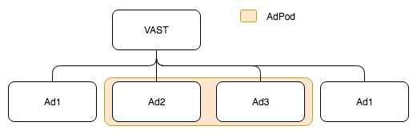

# VASTClient

The `VASTClient` class provides a client to manage the fetching and parsing of VAST documents. It provides methods for fetching VAST resources by resolving the wrapper chain (recursive fetching and parsing) by using the `VASTParser` parsing methods.

- [Constructor](#constructor)
- [Properties](#properties)
- [Methods](#methods)

## Constructor<a name="constructor"></a>

The constructor signature is:

```Javascript
constructor(cappingFreeLunch, cappingMinimumTimeInterval, customStorage)
```

All the parameters are optional.

### Parameters

- **`cappingFreeLunch: Number`** - Used to set the `cappingFreeLunch` property of the class, if not provided a default value of `0` is used for the property
- **`cappingMinimumTimeInterval: Number`** - Used to set the `cappingMinimumTimeInterval` property of the class, if not provided a default value of `0` is used for the property
- **`customStorage: Storage`** - Optional custom storage to be used instead of the default one [`utils/storage.js`](../../src/util/storage.js)

### Example

To get an instance of `VASTClient`, simply import it and create one using the constructor:

```Javascript
import { VASTClient } from 'vast-client'

// With default values
const vastClient = new VASTClient();

// With cappingFreeLunch
const vastClient = new VASTClient(2);

// With cappingMinimumTimeInterval
const vastClient = new VASTClient(0, 2000);

// With customStorage
const vastClient = new VASTClient(0, 0, customStorage);
```

## Properties<a name="properties"></a>

### cappingFreeLunch: Number

The number of calls to skip.

Example: if set to `3`, the first 3 VAST requests will not be executed.

```Javascript
// Ignore the first 2 calls
vastClient.cappingFreeLunch = 2;

// Those following vastClient.get calls won't be done
vastClient.get(VASTUrl);
vastClient.get(VASTUrl);

// VASTUrl will be called
vastClient.get(VASTUrl);
```

### cappingMinimumTimeInterval: Number

The minimum time interval (in milliseconds) which has to pass between the display of an ad and the request for the vast-client.

Example: if set to `2000`, any call which will be requested less than 2 seconds after the last ad displayed will be ignored.

In order for the VASTClient to detect that the ad has been displayed, you must first initialize a [VASTTracker](docs/api/vast-tracker.md)
with the ad and the chosen creative. Then, notify the VASTTracker that the player started to play the ad with `vastTracker.track('start')`

```Javascript
// Ignores any call made 5 minutes or less after the last successful ad
vastClient.cappingMinimumTimeInterval = 5 * 60 * 1000;

const initVastTracker = (ad) => {
 // Choose the creative that fit the best to player
 vastTracker = new VASTTracker(vastClient, ad, ad.creatives[0]);
}

// The call is made
vastClient.get(VASTUrl).then(initVastTracker);

// Elsewhere in the code, Player start to play the ad and notify the vast-tracker
vastTracker.track('start')

// 2 minutes later: The call is ignored
vastClient.get(VASTUrl);

// 6 minutes later: The call is made
vastClient.get(VASTUrl);
```

### storage: Storage

Instance of a class which implements the `Storage` interface. Should be set up only once through the constructor.

## Public Methods 💚 <a name="methods"></a>

### get(url, options): Promise

Gets a parsed VAST document for the given url, applying the skipping rules defined (`cappingFreeLunch` and `cappingMinimumTimeInterval`).

Returns a `Promise` which either resolves with the fully parsed [`VASTResponse`](https://github.com/dailymotion/vast-client-js/blob/master/docs/api/class-reference.md#vastresponse) or rejects with an `Error`.

By default the fully parsed `VASTResponse` contains all the Ads contained in the `VAST` resource. It's possible to get only the first Ad or AdPod and then get the remaining ones on demand by passing `resolveAll: false` in the `options` parameter.

#### Parameters

- **`url: String`** - The url to use to fetch the VAST document
- **`options: Object`** - An optional Object to configure the request:
  - `timeout: Number` - A custom timeout for the requests (default `120000 ms`)
  - `withCredentials: Boolean` - A boolean to enable the withCredentials options for the XHR URLHandler (default `false`)
  - `wrapperLimit: Number` - A number of Wrapper responses that can be received with no InLine response (default `10`)
  - `urlHandler: URLHandler` - Custom urlhandler to be used instead of the default ones [`urlhandlers`](../../src/urlhandlers)
  - `urlhandler: URLHandler` - Fulfills the same purpose as `urlHandler`, which is the preferred parameter to use
  - `resolveAll: Boolean` - Allows you to parse all the ads contained in the VAST or to parse them ad by ad or adPod by adPod (default `true`)
  - `allowMultipleAds: Boolean` - A Boolean value that identifies whether multiple ads are allowed in the requested VAST response. This will override any value of allowMultipleAds attribute set in the VAST
  - `followAdditionalWrappers: Boolean` - a Boolean value that identifies whether subsequent Wrappers after a requested VAST response is allowed. This will override any value of followAdditionalWrappers attribute set in the VAST

#### Example

```Javascript
const vastClient = new VASTClient();

vastClient.get('http://example.dailymotion.com/vast.xml')
  .then(res => {
    // Do something with the parsed VAST response
  })
  .catch(err => {
    // Deal with the error
  });

// With the options optional parameter
const options = {
  withCredentials: true,
  wrapperLimit: 7
};

vastClient.get('http://example.dailymotion.com/vast.xml', options)
  .then(res => {
    // Do something with the parsed VAST response
  })
  .catch(err => {
    // Deal with the error
  });
```
### parseVAST(vastXml, options)<a name="parse"></a>

Parses the given xml Object into a [VASTResponse](https://github.com/dailymotion/vast-client-js/blob/master/docs/api/class-reference.md#vastresponse).
Returns a `Promise` which either resolves with the fully parsed `VASTResponse` or rejects with an `Error`.

By using this method, you will be able to perform fetching in case you want to parse a VAST document and follow a wrappers chain.
If you just need to parse an inline VAST or you want to parse the first VAST document encountered, you should use the **parseVAST** method from the **VASTParser**.

#### Parameters

- **`vastXml: Object`** - An object representing an xml document
- **`options: Object`** - An optional Object of parameters to be used in the parsing process
  - `timeout: Number` - A custom timeout for the possible wrapper resolving requests (default `120000`)
  - `withCredentials: Boolean` - A boolean to enable the withCredentials options for the XHR URLHandler (default `false`)
  - `wrapperLimit: Number` - A number of Wrapper responses that can be received with no InLine response (default `10`)
  - `urlHandler: URLHandler` - Custom urlhandler to be used instead of the default ones [`urlhandlers`](../../src/urlhandlers)
  - `urlhandler: URLHandler` - Fulfills the same purpose as `urlHandler`, which is the preferred parameter to use
  - `allowMultipleAds: Boolean` - A boolean value that identifies whether multiple ads are allowed in the requested VAST response. This will override any value of allowMultipleAds attribute set in the VAST
  - `followAdditionalWrappers: Boolean` - A boolean value that identifies whether subsequent Wrappers after a requested VAST response is allowed. This will override any value of followAdditionalWrappers attribute set in the VAST
  - `requestDuration: Number` - The fetching time of the XML in ms. Provide it with byteLength to have a more accurate estimated bitrate.
  - `byteLength: Number`- The size of the request in bytes. Provide it with requestDuration to have a more accurate estimated bitrate.

#### Events emitted

- **`VAST-resolved`**
- **`VAST-resolving`**
- **`VAST-warning`**

#### Example

```Javascript
const vastXml = (new window.DOMParser()).parseFromString(xmlStr, "text/xml");

vastParser.parseVAST(vastXml)
  .then(res => {
    // Do something with the parsed VAST response
  })
  .catch(err => {
    // Deal with the error
  });

// Or with some options
const options = {
  timeout: 5000,
  withCredentials: true,
  wrapperLimit: 7
}
vastParser.parseVAST(vastXml, options)
  .then(res => {
    // Do something with the parsed VAST response
  })
  .catch(err => {
    // Deal with the error
  });
```


#### How does resolveAll work

Let's consider the VAST shown in the following image: it contains 4 ads, with the 2nd and 3rd defining an AdPod.



Using `get` method with default `options` will return a [`VASTResponse`](https://github.com/dailymotion/vast-client-js/blob/master/docs/api/class-reference.md#vastresponse) containing all the ads resolved, which would look like this:

```Javascript
{
  ads: [
    ad1,
    ad2,
    ad3,
    ad4
  ],
  errorURLTemplates,
  version
}
```

The `resolveAll` parameter allows to request only the first Ad or AdPod. If we pass it as `false` the response would look like:

```Javascript
{
  ads: [
    ad1
  ],
  errorURLTemplates,
  version
}
```

We can then request the remaining ads using `getNextAds` method:

```Javascript
// get the next ad or adPod
vastClient.getNextAds()
  .then(ads => {
    console.log(ads);

    /*
    Will print something like
    {
      ads: [
        ad2,
        ad3
      ],
      errorURLTemplate
    }
    */
  });

// get last ad
vastClient.getNextAds()
  .then(ads => {
    console.log(ads);

    /*
    Will print something like
    {
      ads: [
        ad4
      ],
      errorURLTemplate
    }
    */
  });
```

**Why should you use `resolveAll=false`?**

Most times you will only need the first Ad or AdPod (following ones are usually either optional ads or fallback ones). Using `resolveAll=false` allows you to avoid useless calls to resolve every wrapper chain of the initial VAST.

### hasRemainingAds(): Boolean

Returns `true` if there are remaining ads not returned by the `get` method (in case `resolveAll` was passed as `false`). Returns `false` otherwise.

#### Example

```Javascript
const vastClient = new VASTClient();

// With the options optional parameter
const options = {
  resolveAll: false
};

// Getting a VAST which contains more than one Ad
vastClient.get('http://example.dailymotion.com/vast.xml', options)
  .then(res => {
    // Do something with the parsed VAST response
  })
  .catch(err => {
    // Deal with the error
  });

vastClient.hasRemainingAds(); // Returns true
```

### getNextAds(all): Promise

Returns a `Promise` which either resolves with a [`VASTResponse`](https://github.com/dailymotion/vast-client-js/blob/master/docs/api/class-reference.md#vastresponse) or rejects with an Error.
The resolved `VASTResponse` can contain either a single Ad or AdPod or all the remaining Ads if `all` parameter is passed as `true`.

#### Example

```Javascript
const vastClient = new VASTClient();

// With the options optional parameter
const options = {
  resolveAll: false
};

// Getting a VAST which contains more than one Ad
vastClient.get('http://example.dailymotion.com/vast.xml', options)
  .then(res => {
    // Do something with the parsed VAST response
  })
  .catch(err => {
    // Deal with the error
  });

vastClient.hasRemainingAds(); // Returns true

vastClient.getNextAds()
  .then(res => {
    // Do something with the next Ad
  })
  .catch(err => {
    // Deal with the error
  });

vastClient.getNextAds(true)
  .then(res => {
    // Do something with all the remaining Ads
  })
  .catch(err => {
    // Deal with the error
  });
```

### getParser()

Returns the instance of `VASTParser` used by the client to parse the VAST. Use it to directly call a method provided by the `VASTParser` class.

#### Example

```Javascript
const vastClient = new VASTClient();
const vastParser = vastClient.getParser();

// Clear the url template filters used
vastParser.clearUrlTemplateFilters();
```

### addURLTemplateFilter(filter)

Adds a filter function to the array of filters which are called before fetching a VAST document.

#### Parameters

- **`filter: function`** - The filter function to be added at the end of the array

#### Example

```Javascript
vastClient.addURLTemplateFilter( vastUrl => {
    return url.replace('[DOMAIN]', 'mywebsite.com')
});

/*
For a VASTAdTagURI defined as :
<VASTAdTagURI>http://example.dailymotion.com/vast.php?domain=[DOMAIN]</VASTAdTagURI>
HTTP request will be:
http://example.dailymotion.com/vast.php?domain=mywebsite.com
*/
```

### removeLastURLTemplateFilter()

Removes the last element of the url templates filters array.

#### Example

```Javascript
const replaceDomain = () => {
    return url.replace('[DOMAIN]', 'mywebsite.com')
};

vastClient.addURLTemplateFilter(replaceDomain);
// ...
vastClient.removeURLTemplateFilter(replaceDomain);
// [DOMAIN] placeholder is no longer replaced
```
### countURLTemplateFilters()

Returns the number of filters of the url templates filters array.

#### Example

```Javascript
vastClient.addURLTemplateFilter( vastUrl => {
    return url.replace('[DOMAIN]', 'mywebsite.com')
});

vastClient.countUrlTemplateFilters();
// returns 1
```

### clearURLTemplateFilters()

Removes all the filter functions from the url templates filters array.

#### Example

```Javascript
vastClient.addURLTemplateFilter( vastUrl => {
    return url.replace('[DOMAIN]', 'mywebsite.com')
});

vastClient.clearUrlTemplateFilters();
// [DOMAIN] placeholder is no longer replaced
```
